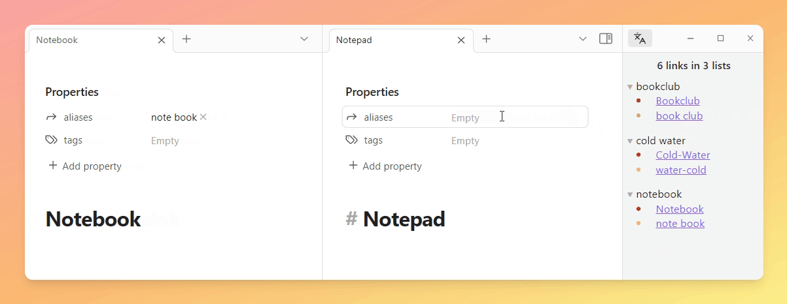
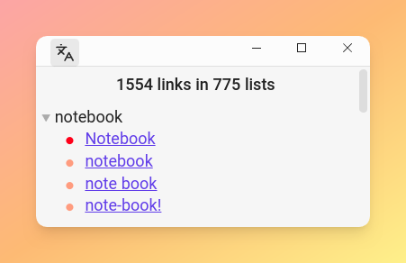
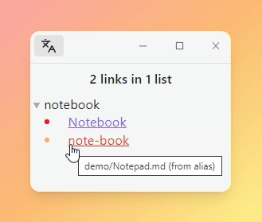
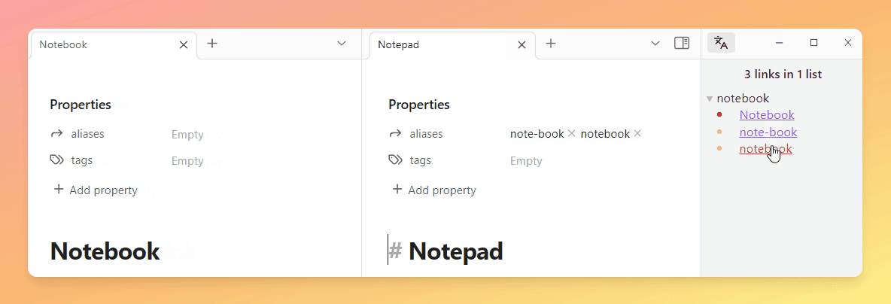
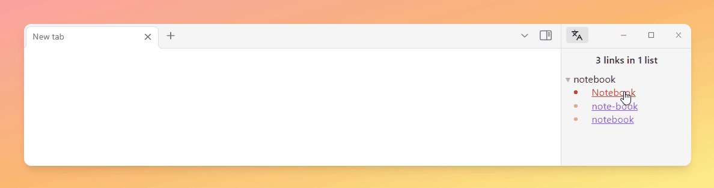
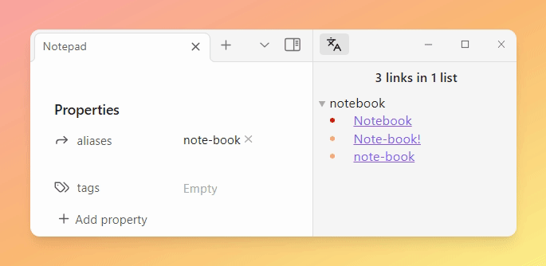
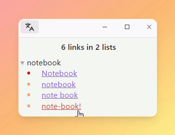
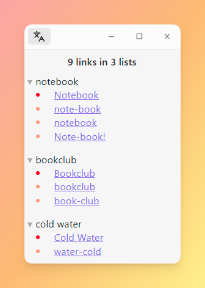
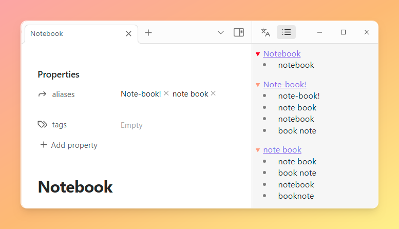

# Alias Management for Obsidian
Identify duplicate notes based on similar aliases and filenames.

This plugin dynamically expands aliases and filenames at runtime, preserving the integrity of files.

# Features

## View duplicate aliases
Easily identify aliases appearing in multiple files, organized into lists. Aliases originate either from filenames or from aliases within files.

  

### Header Overview
The header displays the number of links to aliases along with the number of lists. Hovering over it reveals the count of unique lists.

  

### Color-coded Origins
Alias origins are color-coded for clarity.

- **Red:** Alias derived from the filename.
- **Light red:** Alias derived from aliases within a file.

Hovering over an alias reveals its source file and origin.

  

### Interactive Links
Clicking on an alias opens the corresponding file, streamlining navigation and editing. This feature facilitates quick file renaming with a single shortcut, especially for filename-derived aliases.

**Reading Mode**

Highlighted aliases enable quick identification and removal with a single mouse click if necessary.

  

**Source Mode**

Pre-selected aliases with a leading or trailing comma (if available) allow easy removal by pressing backspace.

  

### Auto update
View updates in real-time as aliases or filenames change, ensuring current data representation.

  

### Disclosure Widgets
Minimize distractions by hiding or showing lists of aliases with a click on the triangle.

  

### Sort order
Lists are sorted by the number of entries, with filename-derived aliases prioritized.

  

## View aliases per file
Open a dedicated view to see aliases generated for individual files.

  

# Settings
- **Add filenames to aliases:** Toggle to include filenames as aliases.
  - Default: True
- **Sort multi-word filenames alphabetically:** Arrange filenames with multiple words alphabetically. For example, `to go` becomes `go to`.
  - Default: True
- **Sort multi-word aliases alphabetically:** Arrange aliases with multiple words alphabetically.
  - Default: True
- **Ignore capitalization:** Toggle to disregard capitalization differences in aliases and filenames. For example, `NOTE` is treated as `note`.
  - Default: True
- **Exclude files:** Exclude files located within specified folder paths. Paths should be comma-separated and relative to the root.
  - Default: `assets`, `images`
- **Replace aliases:** Define regular expressions to replace specific patterns within aliases. For instance, special characters can be replaced with spaces.
  - Default:
    - `s/[^\\w\\s]|_/ /g`: Replace special characters with spaces
    - `s/ //g`: Remove spaces
- **Exclude aliases:** Define regular expressions to exclude specific aliases. This can be useful for filtering out common or irrelevant aliases.
  - Default: `^readme$/i`, `^general$/i`
- **Descending order:** Sort the lists of duplicate aliases in descending order based on the number of occurrences.
  - Default: True
- **Open notes side by side:** Enable to open notes side by side, facilitating easier comparison between files.
  - Default: True

# Feature Pipeline
- [ ] Search for aliases

# Disclaimer
Use this plugin at your own risk. The author takes no responsibility for any damages or loss of data that may occur from using this plugin.
